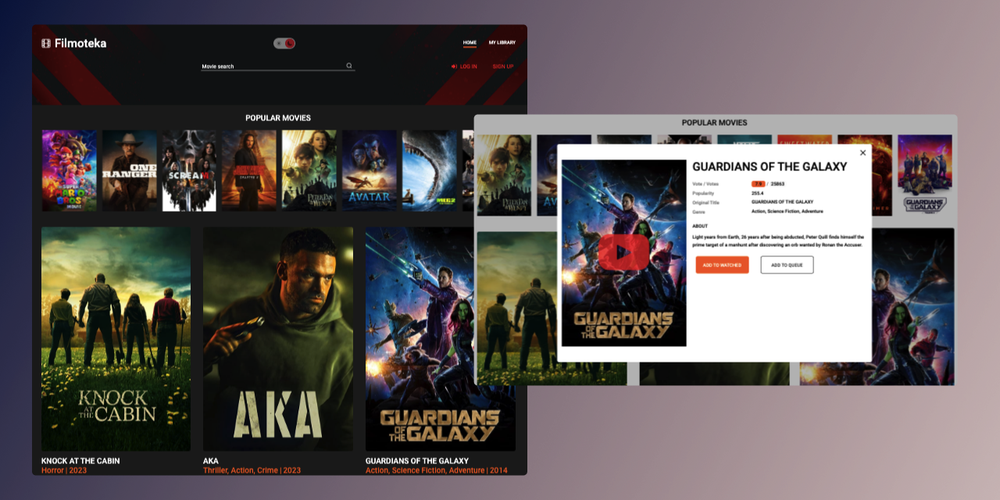
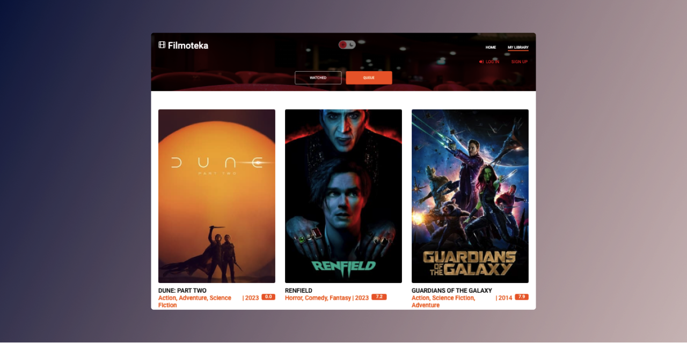
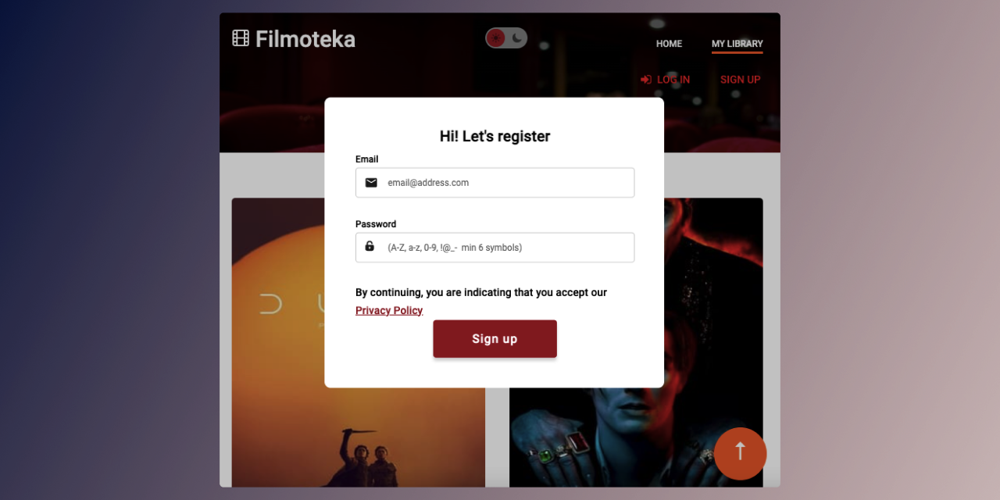

# Filmoteka

Filmoteka is a web application for searching and managing movies.
On the **Home** page, popular movies are displayed, while the **My Library** page showcases the user's movie library.

## Features

1. **Movie Search:** There is a search field in the header of the main page where users can enter search queries.
The search functionality allows users to find movies by title, year, and genre.

2. **Modal Window Features:** Clicking on a movie poster opens a modal window with the following functionality:
- Add the movie to a watchlist.
- Add the movie to a watched list.
- View the movie trailer on YouTube by clicking the "YouTube" button on the movie poster.
- Display additional movie information.

3. **My Library:** Movies added to the watchlist or watched list are accessible on the **My Library** page.

4. **Responsive Design:** The application is designed to be responsive, ensuring it works well on mobile, tablet, and desktop devices.

5. **Pagination:** Pagination is mplemented to display 24 movies per page for a user-friendly experience.

6. **User Registration and Authentication:** Users can register and log in to the application.

## Technologies Used
- HTML
- CSS / SASS
- JavaScript
- REST API (The Movie Database (TMDB) API)
- Authentication (Firebase)

